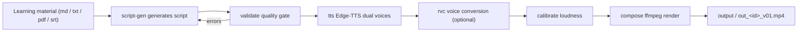

# LearnTok AI

<p align="center">
  <a href="LICENSE"></a>
  
  
</p>

**Let AI make your videos.** LearnTok AI turns **learning material** or a **script JSON** into 9:16 vertical two-character dialogue explainer videos — LLM script generation, Edge-TTS dual voices, RVC voice conversion, and ffmpeg composition, quality-gated and reproducible with `--seed`.

[繁體中文](README.md) · [简体中文](README.zh-CN.md) · **English**

`material / script → LLM script generation → Edge-TTS dual voices → RVC voice conversion → loudness calibration → ffmpeg composition → output/out_<id>_v01.mp4`

- **Code-only skeleton**: no teaching material, models, or copyrighted assets are bundled — bring your own (see [License](#license)).
- **Free TTS voices**: two Edge-TTS voices at zero cost; RVC voice conversion is optional.
- **Controllable quality**: scripts pass a quality gate first; `--seed` keeps output reproducible.

---

## Table of Contents

- [Features](#features)
- [Quick Start](#quick-start)
- [CLI Reference](#cli-reference)
- [How It Works](#how-it-works)
- [Script JSON Schema](#script-json-schema)
- [RAG Knowledge Base (Fact-Check Backend)](#rag-knowledge-base-fact-check-backend)
- [Characters & Assets](#characters--assets)
- [Project Structure](#project-structure)
- [FAQ](#faq)
- [License](#license)

---

## Features

- **Two-character Dialogue**: each video pairs one Questioner (A) with one Explainer (B); characters can be flexibly matched.
- **Free TTS**: Edge-TTS provides two voices; optional RVC voice conversion keeps the duration unchanged with no timeline rework.
- **Quality Gate**: `learntok validate` checks line length, speaker share, mid-script questions from B, banned words, etc.; `learntok fix` applies deterministic post-processing until 0 errors / 0 warnings.
- **RAG Fact-Check**: ChromaDB knowledge-base retrieval; `terms[].source` traces every claim back to its source.
- **Loudness Calibration**: automatically measures character / BGM loudness and writes the settings back.
- **Deterministic**: `--seed` controls background / BGM / randomization, so the same seed reproduces the same video.
- **One-command**: `scripts/make_video.ps1` goes from script to finished video in one shot.

---

## Quick Start

### Prerequisites

| Requirement | Notes |
| --- | --- |
| Windows + PowerShell | Project verified on Windows |
| Python 3.10+ | Verified on 3.12 |
| ffmpeg / ffprobe | `winget install Gyan.FFmpeg`, or place under `pipeline/tools/ffmpeg/` |
| NVIDIA GPU + CUDA | Optional — only needed for RVC |
| DeepSeek API Key | Optional — only needed for `script-gen` |

### First-time Setup

```powershell
powershell -ExecutionPolicy Bypass -File scripts/setup.ps1
```

`setup.ps1` creates a project-local `.venv`, installs dependencies, and runs `pip install -e .` to install the `learntok` CLI (equivalent to `python -m learntok.*`).

> **RVC note**: `fairseq_build/` is not bundled in this repo (the fairseq source is too large). To use RVC,
> download the Source zip of [facebookresearch/fairseq](https://github.com/facebookresearch/fairseq) (tag `v0.12.2`),
> extract it to `fairseq_build/`, then re-run setup.ps1.

After setup, check the environment:

```powershell
.venv\Scripts\learntok.exe doctor
```

### First Video

```powershell
# Render the bundled example script (skips RVC — no GPU needed)
powershell -ExecutionPolicy Bypass -File scripts/make_video.ps1 -ScriptPath pipeline/examples/script_prompt_engineering.json -Seed 42 -SkipRvc
```

Output: `output/out_prompt_engineering_v01.mp4`.

> **Before rendering**: at least one background video is required — put it in `assets/backgrounds/` and register it in
> `assets/manifest.json` (shoot your own or use licensed footage; TTS voice generation needs a network connection).

### Daily Workflow

```powershell
# One-command end-to-end (LLM script generation → TTS → RVC → calibration → composition)
powershell -ExecutionPolicy Bypass -File scripts/make_video.ps1 -Generate -Source material.md -Id my_topic -Seed 42

# Step by step (learntok CLI)
.venv\Scripts\learntok.exe tts --script pipeline/examples/script_prompt_engineering.json
.venv\Scripts\learntok.exe rvc --script pipeline/examples/script_prompt_engineering.json
.venv\Scripts\learntok.exe compose --script pipeline/examples/script_prompt_engineering.json --seed 42
```

> **LLM script generation (optional)**: copy `.env.example` from the repo root to `.env` and fill in `DEEPSEEK_API_KEY`
> (`.env` is gitignored, so it never enters git).

See [`pipeline/README.md`](pipeline/README.md) for detailed pipeline usage.

---

## CLI Reference

| Subcommand | Description |
| --- | --- |
| `learntok make` | Run the full pipeline in one go (TTS → RVC → calibration → composition) |
| `learntok script-gen` | Generate scripts with an LLM (DeepSeek by default; local Ollama / LM Studio supported) |
| `learntok tts` | Edge-TTS speech generation + timeline backfill |
| `learntok rvc` | RVC character voice conversion (requires GPU) |
| `learntok calibrate` | Character / BGM loudness calibration |
| `learntok compose` | ffmpeg composition (subtitles + mixing + rendering) |
| `learntok validate` | Script quality gate (0 errors / 0 warnings) |
| `learntok fix` | Deterministic post-processing (mechanical script fixes) |
| `learntok ingest-srt` | SRT subtitles → script JSON |
| `learntok migrate-terms` | Inline English parentheses → structured terms |
| `learntok rag-build` | Build the ChromaDB knowledge base |
| `learntok rag-retrieve` | Query the knowledge base |
| `learntok doctor` | Environment check |
| `learntok init` | Create a workspace skeleton (`output` / `build` directories, etc.) |

> Run `learntok <subcommand> --help` for per-command options; `python -m learntok.<module>` is the equivalent form.

---

## How It Works



---

## Script JSON Schema

| Field | Type | Description |
| --- | --- | --- |
| `id` | string | Video ID (output filename and build directory) |
| `title` | string | Video title |
| `resolution` | string | Optional, defaults to `720x1280` |
| `characters` | map | `A` / `B` → `name`, `role`, `color` (subtitle color) |
| `lines[]` | array | Per-line dialogue: `speaker`, `text`, `start`, `end` (seconds), `audio_file` |
| `bgm` | object | Optional; BGM is picked by compose based on `--seed` |

```json
{
  "id": "prompt_engineering",
  "title": "為什麼 AI 回答時好時壞？提示工程揭密",
  "characters": {
    "A": {"name": "企鵝燈", "role": "questioner", "color": "#FFD54F"},
    "B": {"name": "熊大", "role": "explainer", "color": "#81C784"}
  },
  "lines": [
    {"speaker": "B", "text": "企鵝燈你問過 AI 奇怪問題嗎", "start": 0.1, "end": 2.956}
  ]
}
```

> `start` / `end` / `audio_file` may be left empty; `learntok tts` backfills them automatically.
> More examples: `pipeline/examples/*.json` (25+ scripts across different topics).

---

## RAG Knowledge Base (Fact-Check Backend)

1. Put redistributable material into `materials/` (supports `.md` / `.txt` / `.json` / `.srt`; see [`materials/README.md`](materials/README.md) for formats).
2. Build: `learntok rag-build --source materials/<series>/<topic> --topic <topic-id> --series <series-id>`
3. Retrieve: `learntok rag-retrieve --query "<question>" --topic <topic-id>`
4. Verify: `learntok validate --script <script.json> --rag-sources` requires `terms[].source` to trace back to the knowledge base.

The knowledge base lives in a local ChromaDB (`assets/rag/`, gitignored and rebuildable).

---

## Characters & Assets

| File | Purpose |
| --- | --- |
| `docs/characters_setting.md` | Character personalities / speaking habits (human-readable, read by `script-gen`) |
| `assets/characters.json` | Character TTS / RVC / color settings (machine-readable) |
| `assets/manifest.json` | Index for background / BGM / avatar assets |
| `assets/rvc_models/manifest.json` | SHA-256 integrity manifest for RVC models (unlisted files are rejected by default) |

> This repo does **not** bundle RVC models, BGM, character avatars, or background videos (third-party IP / copyrighted assets) — prepare legal assets yourself:
> register backgrounds / BGM / avatars in `assets/manifest.json`; put RVC models in `assets/rvc_models/` and update the SHA-256 in
> `assets/rvc_models/manifest.json` (see the character voice settings in `docs/characters_setting.md`).

---

## Project Structure

```
LearnTok AI/
├── src/learntok/        # Python package (pip install -e .; core logic)
│   ├── compose.py       # Main composition script (ffmpeg)
│   ├── cli.py / config.py / doctor.py
│   ├── tools/           # script_gen / tts_edge / rvc_convert / rag_* / validate_script etc.
│   └── templates/script_prompt.md
├── pyproject.toml       # Package definition (console_scripts: learntok)
├── pipeline/            # Pipeline docs and examples
│   ├── README.md        # Detailed pipeline usage
│   ├── examples/        # Script JSON examples (25+)
│   └── tools/           # verify_renders.ps1 / .env.example / ffmpeg (local)
├── scripts/             # One-command scripts (setup.ps1 / make_video.ps1 / start_rvc_webui.ps1)
├── materials/           # RAG knowledge-base material (put redistributable content here)
├── assets/              # Character settings and asset indexes (characters.json / manifest.json)
├── docs/                # Character settings docs (characters_setting.md)
└── tests/               # unittest (python -m unittest discover -s tests)
```

---

## FAQ

- **`learntok doctor` shows a red flag?** Check in order: whether ffmpeg is installed, whether `assets/characters.json` and `assets/manifest.json` exist, and whether `DEEPSEEK_API_KEY` is set.
- **fairseq WARN?** Only needed for RVC; download fairseq into `fairseq_build/` and re-run `setup.ps1`.
- **`learntok validate` fails?** Run `learntok fix --script <script.json>` to auto-fix first, then re-validate.
- **`script-gen` says API key not found?** Copy `.env.example` to `.env` and fill in `DEEPSEEK_API_KEY`, or use `--provider local --model <local-model>`.
- **Background / BGM missing?** Add assets to the matching directories yourself and register them in `assets/manifest.json`.
- **RVC model rejected?** Models must be listed in `assets/rvc_models/manifest.json` (SHA-256 verification); unlisted files are rejected by default. If you trust the model, add `--allow-unverified` to force-load it (a warning will be shown).

---

## License

- The code is released under the **MIT License** (Copyright © 2026 DLeungDL); see [`LICENSE`](LICENSE) for the full text.
- This repo is a **code-only skeleton**: learning material, RVC models, BGM, character avatars, and background videos are third-party / copyrighted assets and are **not distributed with the repo** — prepare legal assets yourself; their licenses are outside the MIT License.
- Learning material may be placed in `materials/` (must be freely redistributable, e.g. MIT / CC licensed) for `learntok rag-build` to build the knowledge base.

---

## Notes

This public repo is the "code skeleton" of the full project: private teaching material, RVC models, copyrighted music, and third-party IP
assets are not distributed with the public release — prepare them yourself.
