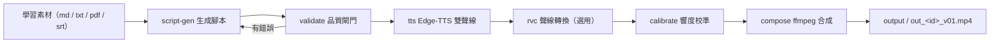

# LearnTok AI

<p align="center">
  <a href="LICENSE"></a>
  <a href="https://github.com/DLeungDL/LearnTok"></a>
  
</p>

**讓 AI 幫你出片。** LearnTok AI 把**學習素材**或**腳本 JSON** 變成 9:16 豎屏雙人對話科普影片 — LLM 生成腳本、Edge-TTS 雙聲線、RVC 聲線轉換與 ffmpeg 合成，品質閘門把關、`--seed` 可重現。

[English](README.en.md) · [简体中文](README.zh-CN.md) · **繁體中文**

`素材 / 腳本 → LLM 腳本生成 → Edge-TTS 雙聲線 → RVC 聲線轉換 → 響度校準 → ffmpeg 合成 → output/out_<id>_v01.mp4`

- **純程式骨架**：不附教材、模型與版權素材，全部自行準備（見 [License（授權）](#license授權)）。
- **零成本語音**：Edge-TTS 免費雙聲線；RVC 聲線轉換選用。
- **品質可控**：腳本先過品質閘門，`--seed` 保證可重現。

---

## 目錄（Table of Contents）

- [功能特色](#功能特色features)
- [快速開始](#快速開始quick-start)
- [CLI 指令總覽](#cli-指令總覽cli-reference)
- [運作流程](#運作流程how-it-works)
- [腳本 JSON Schema](#腳本-json-schema)
- [RAG 知識庫](#rag-知識庫fact-check-backend)
- [角色與素材](#角色與素材characters--assets)
- [專案結構](#專案結構project-structure)
- [常見問題](#常見問題faq)
- [License（授權）](#license授權)

---

## 功能特色（Features）

- **雙角色對話（Two-character Dialogue）**：每支影片 = 1 個 Questioner 提問役（A）＋ 1 個 Explainer 解答役（B），角色可彈性配對。
- **免費語音合成（TTS）**：Edge-TTS 雙聲線；可選 RVC 角色聲線轉換（Voice Conversion），時長不變、無需重排時間軸。
- **品質閘門（Quality Gate）**：`learntok validate` 檢查行長、說話者佔比、B 中段問句、禁用詞等；`learntok fix` 做確定性後處理，直到 0 錯誤 0 警告。
- **RAG 事實查核（Fact-Check）**：ChromaDB 知識庫檢索，`terms[].source` 可回溯出處。
- **響度校準（Loudness Calibration）**：自動量測角色／BGM 響度並回寫設定。
- **可重現（Deterministic）**：`--seed` 控制背景／BGM／隨機化，同 seed 可重出同片。
- **一鍵出片（One-command）**：`scripts/make_video.ps1` 從腳本到成品一條龍。

---

## 快速開始（Quick Start）

### 環境需求（Prerequisites）

| 需求 | 說明 |
| --- | --- |
| Windows ＋ PowerShell | 專案以 Windows 驗證 |
| Python 3.10+ | 以 3.12 驗證 |
| ffmpeg / ffprobe | `winget install Gyan.FFmpeg`，或放入 `pipeline/tools/ffmpeg/` |
| NVIDIA GPU ＋ CUDA | 選用，只有 RVC 需要 |
| DeepSeek API Key | 選用，只有 `script-gen` 需要 |

### 首次設定（First-time Setup）

```powershell
powershell -ExecutionPolicy Bypass -File scripts/setup.ps1
```

`setup.ps1` 會建立專案內 `.venv`、安裝依賴，並執行 `pip install -e .` 安裝 `learntok` CLI（與 `python -m learntok.*` 等價）。

> **RVC 注意**：`fairseq_build/` 未納入本 repo（fairseq 源碼過大）。如需跑 RVC，
> 下載 [facebookresearch/fairseq](https://github.com/facebookresearch/fairseq)（tag `v0.12.2`）
> 的 Source zip，解壓縮到 `fairseq_build/` 後再執行 setup.ps1。

設定完成後先跑環境檢查：

```powershell
.venv\Scripts\learntok.exe doctor
```

### 第一支影片（First Video）

```powershell
# 用內建範例腳本出片（跳過 RVC，不需要 GPU）
powershell -ExecutionPolicy Bypass -File scripts/make_video.ps1 -ScriptPath pipeline/examples/script_prompt_engineering.json -Seed 42 -SkipRvc
```

產出：`output/out_prompt_engineering_v01.mp4`。

> **出片前準備**：實際渲染需要至少一段背景影片，放入 `assets/backgrounds/` 並登記至
> `assets/manifest.json`（背景可自行拍攝或使用授權素材；TTS 語音生成需網路連線）。

### 日常使用（Daily Workflow）

```powershell
# 一鍵全自動（LLM 生成腳本 → TTS → RVC → 響度校準 → 合成）
powershell -ExecutionPolicy Bypass -File scripts/make_video.ps1 -Generate -Source 素材.md -Id my_topic -Seed 42

# 分步執行（learntok CLI）
.venv\Scripts\learntok.exe tts --script pipeline/examples/script_prompt_engineering.json
.venv\Scripts\learntok.exe rvc --script pipeline/examples/script_prompt_engineering.json
.venv\Scripts\learntok.exe compose --script pipeline/examples/script_prompt_engineering.json --seed 42
```

> **LLM 腳本生成（選用）**：複製根目錄 `.env.example` 為 `.env`，填入 `DEEPSEEK_API_KEY`
> （`.env` 已被 gitignore，不會進 git）。

詳細管線用法見 [`pipeline/README.md`](pipeline/README.md)。

---

## CLI 指令總覽（CLI Reference）

| 子命令 | 說明 |
| --- | --- |
| `learntok make` | 一鍵跑完整管線（TTS → RVC → 校準 → 合成） |
| `learntok script-gen` | LLM 生成腳本（DeepSeek 預設，支援本機 Ollama／LM Studio） |
| `learntok tts` | Edge-TTS 語音生成＋時間軸回填 |
| `learntok rvc` | RVC 角色聲線轉換（需 GPU） |
| `learntok calibrate` | 角色／BGM 響度校準 |
| `learntok compose` | ffmpeg 合成（字幕＋混音＋渲染） |
| `learntok validate` | 腳本品質閘門（0 錯誤／0 警告） |
| `learntok fix` | 確定性後處理（機械修正腳本） |
| `learntok ingest-srt` | SRT 字幕 → 腳本 JSON |
| `learntok migrate-terms` | 行內英文括號 → 結構化 terms |
| `learntok rag-build` | 建立 ChromaDB 知識庫 |
| `learntok rag-retrieve` | 檢索知識庫 |
| `learntok doctor` | 環境檢查 |
| `learntok init` | 建立工作區骨架（output／build 等目錄） |

> 每個子命令皆可用 `learntok <子命令> --help` 查看參數；`python -m learntok.<模組>` 為等價寫法。

---

## 運作流程（How It Works）



---

## 腳本 JSON Schema

| 欄位 | 型別 | 說明 |
| --- | --- | --- |
| `id` | string | 影片 ID（輸出檔名與建構目錄） |
| `title` | string | 影片標題 |
| `resolution` | string | 選填，預設 `720x1280` |
| `characters` | map | `A`／`B` → `name`、`role`、`color`（字幕配色） |
| `lines[]` | array | 逐句對白：`speaker`、`text`、`start`、`end`（秒）、`audio_file` |
| `bgm` | object | 選填，BGM 由 compose 依 `--seed` 挑選 |

```json
{
  "id": "prompt_engineering",
  "title": "為什麼 AI 回答時好時壞？提示工程揭密",
  "characters": {
    "A": {"name": "企鵝燈", "role": "questioner", "color": "#FFD54F"},
    "B": {"name": "熊大", "role": "explainer", "color": "#81C784"}
  },
  "lines": [
    {"speaker": "B", "text": "企鵝燈你問過 AI 奇怪問題嗎", "start": 0.1, "end": 2.956}
  ]
}
```

> `start`／`end`／`audio_file` 可留空，`learntok tts` 會自動回填。
> 完整範例見 `pipeline/examples/*.json`（25+ 支腳本，含不同主題）。

---

## RAG 知識庫（Fact-Check Backend）

1. 將可散佈教材放入 `materials/`（支援 `.md`／`.txt`／`.json`／`.srt`，格式見 [`materials/README.md`](materials/README.md)）。
2. 建庫：`learntok rag-build --source materials/<系列>/<主題> --topic <主題-id> --series <系列-id>`
3. 檢索：`learntok rag-retrieve --query "<問題>" --topic <主題-id>`
4. 校驗：`learntok validate --script <腳本.json> --rag-sources` 要求 `terms[].source` 可回溯知識庫。

知識庫存於本機 ChromaDB（`assets/rag/`，gitignored、可重建）。

---

## 角色與素材（Characters & Assets）

| 檔案 | 用途 |
| --- | --- |
| `docs/characters_setting.md` | 角色性格／說話習慣（人類可讀，`script-gen` 讀取） |
| `assets/characters.json` | 角色 TTS／RVC／配色設定（機器可讀） |
| `assets/manifest.json` | 背景／BGM／頭像素材索引 |
| `assets/rvc_models/manifest.json` | RVC 模型 SHA-256 完整性清單（未列出的檔案預設拒絕載入） |

> 本 repo **不附** RVC 模型、BGM、角色頭像與背景影片（第三方 IP／版權素材），請自行準備合法素材：
> 背景／BGM／頭像登記至 `assets/manifest.json`；RVC 模型放入 `assets/rvc_models/` 並更新
> `assets/rvc_models/manifest.json` 的 SHA-256（可參考 `docs/characters_setting.md` 的角色聲線設定）。

---

## 專案結構（Project Structure）

```
LearnTok AI/
├── src/learntok/        # Python 套件（pip install -e .，核心邏輯）
│   ├── compose.py       # 主合成腳本（ffmpeg）
│   ├── cli.py / config.py / doctor.py
│   ├── tools/           # script_gen / tts_edge / rvc_convert / rag_* / validate_script 等
│   └── templates/script_prompt.md
├── pyproject.toml       # 套件定義（console_scripts: learntok）
├── pipeline/            # 管線文件與範例
│   ├── README.md        # 管線詳細用法
│   ├── examples/        # 腳本 JSON 範例（25+ 支）
│   └── tools/           # verify_renders.ps1 / .env.example / ffmpeg（本機）
├── scripts/             # 一鍵腳本（setup.ps1 / make_video.ps1 / start_rvc_webui.ps1）
├── materials/           # RAG 知識庫素材（自行放入可散佈教材）
├── assets/              # 角色設定與素材索引（characters.json / manifest.json）
├── docs/                # 角色設定文件（characters_setting.md）
└── tests/               # unittest（python -m unittest discover -s tests）
```

---

## 常見問題（FAQ）

- **`learntok doctor` 有紅燈？** 依序檢查：ffmpeg 是否安裝、`assets/characters.json` 與 `assets/manifest.json` 是否存在、`DEEPSEEK_API_KEY` 是否設定。
- **fairseq WARN？** 僅 RVC 需要；下載 fairseq 放 `fairseq_build/` 後重跑 `setup.ps1`。
- **`learntok validate` 失敗？** 先跑 `learntok fix --script <腳本.json>` 自動修正，再重新驗證。
- **`script-gen` 報找不到 API key？** 複製 `.env.example` 為 `.env` 並填入 `DEEPSEEK_API_KEY`，或用 `--provider local --model <本機模型>`。
- **找不到背景／BGM？** 素材需自行放入對應目錄並登記至 `assets/manifest.json`。
- **RVC 模型被拒絕載入？** 模型必須列在 `assets/rvc_models/manifest.json`（SHA-256 驗證），未列出的檔案預設拒絕；確認後可加 `--allow-unverified` 強制載入（會有警告）。

---

## License（授權）

- 程式碼以 **MIT License** 釋出（Copyright © 2026 DLeungDL），全文見 [`LICENSE`](LICENSE)。
- 本 repo 為**程式骨架**：學習教材、RVC 模型、BGM、角色頭像與背景影片等第三方／版權素材
  **不隨 repo 散佈**，請自行準備合法素材；其授權不屬 MIT License 涵蓋範圍。
- 學習教材可放入 `materials/`（需可自由散佈，如 MIT／CC 授權），供 `learntok rag-build` 建立知識庫。

---

## 說明（Notes）

本公開 repo 是完整專案的「程式骨架」：私人教材、RVC 模型、版權音樂與第三方 IP
素材皆不隨公開版散佈，請自行準備。
