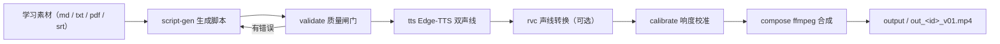

# LearnTok AI

<p align="center">
  <a href="LICENSE"></a>
  <a href="https://github.com/DLeungDL/LearnTok"></a>
  
</p>

**让 AI 帮你出片。** LearnTok AI 把**学习素材**或**脚本 JSON** 变成 9:16 竖屏双人对话科普视频 — LLM 生成脚本、Edge-TTS 双声线、RVC 声线转换与 ffmpeg 合成，质量闸门把关、`--seed` 可复现。

[繁體中文](README.md) · **简体中文** · [English](README.en.md)

`素材 / 脚本 → LLM 脚本生成 → Edge-TTS 双声线 → RVC 声线转换 → 响度校准 → ffmpeg 合成 → output/out_<id>_v01.mp4`

- **纯程序骨架**：不附带教材、模型与版权素材，全部自行准备（见 [License（授权）](#license授权)）。
- **零成本语音**：Edge-TTS 免费双声线；RVC 声线转换可选。
- **质量可控**：脚本先通过质量闸门，`--seed` 保证可复现。

---

## 目录（Table of Contents）

- [功能特色](#功能特色features)
- [快速开始](#快速开始quick-start)
- [CLI 指令总览](#cli-指令总览cli-reference)
- [运作流程](#运作流程how-it-works)
- [脚本 JSON Schema](#脚本-json-schema)
- [RAG 知识库](#rag-知识库fact-check-backend)
- [角色与素材](#角色与素材characters--assets)
- [项目结构](#项目结构project-structure)
- [常见问题](#常见问题faq)
- [License（授权）](#license授权)

---

## 功能特色（Features）

- **双角色对话（Two-character Dialogue）**：每支视频 = 1 个 Questioner 提问役（A）＋ 1 个 Explainer 解答役（B），角色可灵活配对。
- **免费语音合成（TTS）**：Edge-TTS 双声线；可选 RVC 角色声线转换（Voice Conversion），时长不变、无需重排时间轴。
- **质量闸门（Quality Gate）**：`learntok validate` 检查行长、说话者占比、B 中段问句、禁用词等；`learntok fix` 做确定性后处理，直到 0 错误 0 警告。
- **RAG 事实查核（Fact-Check）**：ChromaDB 知识库检索，`terms[].source` 可回溯出处。
- **响度校准（Loudness Calibration）**：自动测量角色／BGM 响度并回写设置。
- **可复现（Deterministic）**：`--seed` 控制背景／BGM／随机化，同 seed 可重出同片。
- **一键出片（One-command）**：`scripts/make_video.ps1` 从脚本到成品一条龙。

---

## 快速开始（Quick Start）

### 环境需求（Prerequisites）

| 需求 | 说明 |
| --- | --- |
| Windows ＋ PowerShell | 项目以 Windows 验证 |
| Python 3.10+ | 以 3.12 验证 |
| ffmpeg / ffprobe | `winget install Gyan.FFmpeg`，或放入 `pipeline/tools/ffmpeg/` |
| NVIDIA GPU ＋ CUDA | 可选，只有 RVC 需要 |
| DeepSeek API Key | 可选，只有 `script-gen` 需要 |

### 首次设置（First-time Setup）

```powershell
powershell -ExecutionPolicy Bypass -File scripts/setup.ps1
```

`setup.ps1` 会建立项目内 `.venv`、安装依赖，并执行 `pip install -e .` 安装 `learntok` CLI（与 `python -m learntok.*` 等价）。

> **RVC 注意**：`fairseq_build/` 未纳入本 repo（fairseq 源码过大）。如需跑 RVC，
> 下载 [facebookresearch/fairseq](https://github.com/facebookresearch/fairseq)（tag `v0.12.2`）
> 的 Source zip，解压到 `fairseq_build/` 后再执行 setup.ps1。

设置完成后先跑环境检查：

```powershell
.venv\Scripts\learntok.exe doctor
```

### 第一支视频（First Video）

```powershell
# 用内置示例脚本出片（跳过 RVC，不需要 GPU）
powershell -ExecutionPolicy Bypass -File scripts/make_video.ps1 -ScriptPath pipeline/examples/script_prompt_engineering.json -Seed 42 -SkipRvc
```

产出：`output/out_prompt_engineering_v01.mp4`。

> **出片前准备**：实际渲染需要至少一段背景视频，放入 `assets/backgrounds/` 并登记至
> `assets/manifest.json`（背景可自行拍摄或使用授权素材；TTS 语音生成需网络连接）。

### 日常使用（Daily Workflow）

```powershell
# 一键全自动（LLM 生成脚本 → TTS → RVC → 响度校准 → 合成）
powershell -ExecutionPolicy Bypass -File scripts/make_video.ps1 -Generate -Source 素材.md -Id my_topic -Seed 42

# 分步执行（learntok CLI）
.venv\Scripts\learntok.exe tts --script pipeline/examples/script_prompt_engineering.json
.venv\Scripts\learntok.exe rvc --script pipeline/examples/script_prompt_engineering.json
.venv\Scripts\learntok.exe compose --script pipeline/examples/script_prompt_engineering.json --seed 42
```

> **LLM 脚本生成（可选）**：复制根目录 `.env.example` 为 `.env`，填入 `DEEPSEEK_API_KEY`
> （`.env` 已被 gitignore，不会进 git）。

详细管线用法见 [`pipeline/README.md`](pipeline/README.md)。

---

## CLI 指令总览（CLI Reference）

| 子命令 | 说明 |
| --- | --- |
| `learntok make` | 一键跑完整管线（TTS → RVC → 校准 → 合成） |
| `learntok script-gen` | LLM 生成脚本（DeepSeek 默认，支持本机 Ollama／LM Studio） |
| `learntok tts` | Edge-TTS 语音生成＋时间轴回填 |
| `learntok rvc` | RVC 角色声线转换（需 GPU） |
| `learntok calibrate` | 角色／BGM 响度校准 |
| `learntok compose` | ffmpeg 合成（字幕＋混音＋渲染） |
| `learntok validate` | 脚本质量闸门（0 错误／0 警告） |
| `learntok fix` | 确定性后处理（机械修正脚本） |
| `learntok ingest-srt` | SRT 字幕 → 脚本 JSON |
| `learntok migrate-terms` | 行内英文括号 → 结构化 terms |
| `learntok rag-build` | 建立 ChromaDB 知识库 |
| `learntok rag-retrieve` | 检索知识库 |
| `learntok doctor` | 环境检查 |
| `learntok init` | 建立工作区骨架（output／build 等目录） |

> 每个子命令皆可用 `learntok <子命令> --help` 查看参数；`python -m learntok.<模块>` 为等价写法。

---

## 运作流程（How It Works）



---

## 脚本 JSON Schema

| 字段 | 类型 | 说明 |
| --- | --- | --- |
| `id` | string | 视频 ID（输出文件名与构建目录） |
| `title` | string | 视频标题 |
| `resolution` | string | 可选，默认 `720x1280` |
| `characters` | map | `A`／`B` → `name`、`role`、`color`（字幕配色） |
| `lines[]` | array | 逐句对白：`speaker`、`text`、`start`、`end`（秒）、`audio_file` |
| `bgm` | object | 可选，BGM 由 compose 依 `--seed` 挑选 |

```json
{
  "id": "prompt_engineering",
  "title": "為什麼 AI 回答時好時壞？提示工程揭密",
  "characters": {
    "A": {"name": "企鵝燈", "role": "questioner", "color": "#FFD54F"},
    "B": {"name": "熊大", "role": "explainer", "color": "#81C784"}
  },
  "lines": [
    {"speaker": "B", "text": "企鵝燈你問過 AI 奇怪問題嗎", "start": 0.1, "end": 2.956}
  ]
}
```

> `start`／`end`／`audio_file` 可留空，`learntok tts` 会自动回填。
> 完整示例见 `pipeline/examples/*.json`（25+ 支脚本，含不同主题）。

---

## RAG 知识库（Fact-Check Backend）

1. 将可散布教材放入 `materials/`（支持 `.md`／`.txt`／`.json`／`.srt`，格式见 [`materials/README.md`](materials/README.md)）。
2. 建库：`learntok rag-build --source materials/<系列>/<主题> --topic <主题-id> --series <系列-id>`
3. 检索：`learntok rag-retrieve --query "<问题>" --topic <主题-id>`
4. 校验：`learntok validate --script <脚本.json> --rag-sources` 要求 `terms[].source` 可回溯知识库。

知识库存于本机 ChromaDB（`assets/rag/`，gitignored、可重建）。

---

## 角色与素材（Characters & Assets）

| 文件 | 用途 |
| --- | --- |
| `docs/characters_setting.md` | 角色性格／说话习惯（人类可读，`script-gen` 读取） |
| `assets/characters.json` | 角色 TTS／RVC／配色设置（机器可读） |
| `assets/manifest.json` | 背景／BGM／头像素材索引 |
| `assets/rvc_models/manifest.json` | RVC 模型 SHA-256 完整性清单（未列出的文件默认拒绝加载） |

> 本 repo **不附** RVC 模型、BGM、角色头像与背景视频（第三方 IP／版权素材），请自行准备合法素材：
> 背景／BGM／头像登记至 `assets/manifest.json`；RVC 模型放入 `assets/rvc_models/` 并更新
> `assets/rvc_models/manifest.json` 的 SHA-256（可参考 `docs/characters_setting.md` 的角色声线设置）。

---

## 项目结构（Project Structure）

```
LearnTok AI/
├── src/learntok/        # Python 套件（pip install -e .，核心逻辑）
│   ├── compose.py       # 主合成脚本（ffmpeg）
│   ├── cli.py / config.py / doctor.py
│   ├── tools/           # script_gen / tts_edge / rvc_convert / rag_* / validate_script 等
│   └── templates/script_prompt.md
├── pyproject.toml       # 套件定义（console_scripts: learntok）
├── pipeline/            # 管线文档与示例
│   ├── README.md        # 管线详细用法
│   ├── examples/        # 脚本 JSON 示例（25+ 支）
│   └── tools/           # verify_renders.ps1 / .env.example / ffmpeg（本机）
├── scripts/             # 一键脚本（setup.ps1 / make_video.ps1 / start_rvc_webui.ps1）
├── materials/           # RAG 知识库素材（自行放入可散布教材）
├── assets/              # 角色设置与素材索引（characters.json / manifest.json）
├── docs/                # 角色设置文档（characters_setting.md）
└── tests/               # unittest（python -m unittest discover -s tests）
```

---

## 常见问题（FAQ）

- **`learntok doctor` 有红灯？** 依次检查：ffmpeg 是否安装、`assets/characters.json` 与 `assets/manifest.json` 是否存在、`DEEPSEEK_API_KEY` 是否设置。
- **fairseq WARN？** 仅 RVC 需要；下载 fairseq 放 `fairseq_build/` 后重跑 `setup.ps1`。
- **`learntok validate` 失败？** 先跑 `learntok fix --script <脚本.json>` 自动修正，再重新验证。
- **`script-gen` 报找不到 API key？** 复制 `.env.example` 为 `.env` 并填入 `DEEPSEEK_API_KEY`，或用 `--provider local --model <本机模型>`。
- **找不到背景／BGM？** 素材需自行放入对应目录并登记至 `assets/manifest.json`。
- **RVC 模型被拒绝加载？** 模型必须列在 `assets/rvc_models/manifest.json`（SHA-256 验证），未列出的文件默认拒绝；确认后可加 `--allow-unverified` 强制加载（会有警告）。

---

## License（授权）

- 代码以 **MIT License** 释出（Copyright © 2026 DLeungDL），全文见 [`LICENSE`](LICENSE)。
- 本 repo 为**程序骨架**：学习教材、RVC 模型、BGM、角色头像与背景视频等第三方／版权素材
  **不随 repo 散布**，请自行准备合法素材；其授权不属 MIT License 涵盖范围。
- 学习教材可放入 `materials/`（需可自由散布，如 MIT／CC 授权），供 `learntok rag-build` 建立知识库。

---

## 说明（Notes）

本公开 repo 是完整项目的「程序骨架」：私人教材、RVC 模型、版权音乐与第三方 IP
素材皆不随公开版散布，请自行准备。
