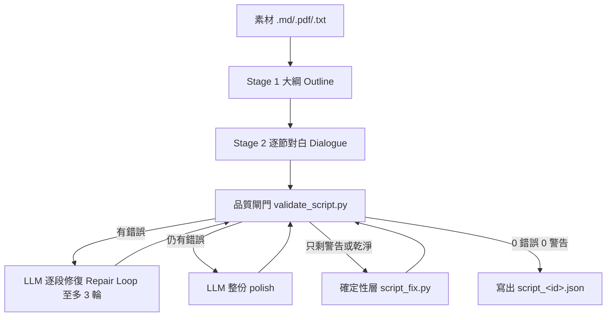

# LearnTok AI 生成管線（Compositing Pipeline）

「素材庫＋ffmpeg 自動合成」原型：輸入雙角色對白腳本 JSON，輸出 720×1280 豎屏科普影片。

```
腳本 JSON ─┬─ tools/tts_edge.py ──► assets/audio/lines/*.mp3（逐句雙聲線）
           │                        + 回填 start/end 時間軸
           │                        ↓
           ├─ tools/rvc_convert.py ──► 角色本尊聲線轉換（燈 model v1）
           │                        （時長不變，直接覆蓋 MP3）
           ├─ assets/manifest.json（背景素材/BGM 索引）
           └─ compose.py ──► Pass A: voiceover.wav（逐句對齊混音）
                          ──► Pass B: 背景串接＋查重處理
                              ＋ ASS 字幕燒錄＋混音 ──► output/out_<id>_v01.mp4
```

## 環境需求（Prerequisites）

1. **ffmpeg / ffprobe**（必要）：
   ```powershell
   winget install Gyan.FFmpeg
   ```
   安裝後重開終端機，確認 `ffmpeg -version` 可用。專案已內建 `pipeline/tools/ffmpeg/`。
2. **Python 依賴**（TTS + RVC）：一鍵安裝至專案內 `.venv/`：
   ```powershell
   powershell -ExecutionPolicy Bypass -File scripts/setup.ps1
   ```
   - `.venv/` 建在專案目錄內，Codex 快取清除不受影響
   - 重複執行會自動偵測已安裝套件，跳過重裝
   - 依賴清單見 `requirements.txt`；核心套件以 `pip install -e .` 安裝（setup.ps1 Step 7）
3. **網路連線**：Edge-TTS 現已可直接連線（無需 VPN）。
4. **RVC 推理環境**（角色聲線轉換，選用）：
   - `pip install torch torchaudio --index-url https://download.pytorch.org/whl/cu121`
   - `pip install rvc-python --no-deps` + 手動補裝依賴（faiss-cpu, librosa, pyworld, torchcrepe, praat-parselmouth, fairseq 等）
   - fairseq 需從 git 安裝並修補 Python 3.12 相容性（見 `src/learntok/tools/utils_patched.py`）
   - 需 NVIDIA GPU（CUDA）；本專案以 RTX 4070 驗證
4. Python 3.10+（本專案以 Codex 內建 Python 3.12 驗證）。

## 使用流程（Workflow）

```powershell
# 0a. 一鍵全自動（TTS → RVC → 響度校準 → 合成）— learntok CLI
.venv\Scripts\learntok.exe make --script pipeline/examples/sample_script.json --seed 42
#     選項：--skip-tts / --skip-rvc / --skip-calibrate / --dry-run
#     或直接用「按鈕」：powershell -ExecutionPolicy Bypass -File scripts/make_video.ps1 -ScriptPath pipeline/examples/sample_script.json

# 0. 從 SRT 產生腳本 JSON（或用 LLM 依 schema 直接產出）
.venv\Scripts\learntok.exe ingest-srt --srt <字幕.srt> --out pipeline/examples/sample_script.json --id revive --max-duration 120

# 1. 生成雙聲線語音並回填時間軸（edge-tts + ffprobe）
#    燈(A)=XiaoyiNeural（+12%語速）/ 派大星(B)=YunjianNeural（-12%語速）
.venv\Scripts\learntok.exe tts --script pipeline/examples/sample_script.json

# 1b. RVC 語音轉換（選用）— 把通用聲線換成角色本尊聲線
#    燈 model: assets/rvc_models/rvc_deng_v1.pth + .index
#    pitch +6（女聲基底→燈）；男聲基底則用 +12
#    完整性：模型/索引/base model 載入前會對 assets/rvc_models/manifest.json
#    的 SHA-256 驗證；未列出的檔案預設拒絕載入（--allow-unverified 強制載入並警告）
.venv\Scripts\learntok.exe rvc --script pipeline/examples/sample_script.json --dry-run  # 預覽
.venv\Scripts\learntok.exe rvc --script pipeline/examples/sample_script.json             # 執行
.venv\Scripts\learntok.exe rvc --script pipeline/examples/sample_script.json --pitch 12 # 自訂變調

# 1c. 響度校準（選用）— 量測角色/BGM 響度，自動寫回 characters.json / manifest.json
.venv\Scripts\learntok.exe calibrate --script pipeline/examples/sample_script.json  # --dry-run 僅預覽

# 2. 把背景素材放入 assets/backgrounds/，並登記到 assets/manifest.json

# 3. 試算（不執行 ffmpeg，只產出字幕/濾鏡圖/指令）
.venv\Scripts\learntok.exe compose --script pipeline/examples/sample_script.json --dry-run

# 4. 正式合成
.venv\Scripts\learntok.exe compose --script pipeline/examples/sample_script.json --seed 42

# 等價的 python -m 寫法：
.venv\Scripts\python.exe -m learntok.tools.tts_edge --script pipeline/examples/sample_script.json
```

## 腳本 JSON Schema

| 欄位 | 型別 | 說明 |
| --- | --- | --- |
| `id` | string | 影片 ID，用於輸出檔名與建構目錄 |
| `resolution` | string | 預設 `720x1280` |
| `characters` | map | 角色鍵（`A`/`B`）→ `name`、`role`、`color`（字幕配色） |
| `lines[]` | array | 逐句對白：`speaker`、`text`、`start`、`end`（秒）、`audio_file`（選填，相對 assets/） |
| `bgm` | object | 選填（legacy）：BGM 由 compose 依 `--seed` 隨機挑選，音量以 manifest 每軌校準值為準 |

## compose.py 參數（CLI Options）

| 參數 | 預設 | 說明 |
| --- | --- | --- |
| `--script` | （必填） | 腳本 JSON 路徑 |
| `--manifest` | `assets/manifest.json` | 素材索引 |
| `--out` | `output/out_<id>_v01.mp4` | 輸出檔案 |
| `--seed` | 無（隨機） | 背景/BGM 隨機種子；省略＝每次隨機，同 seed 可重現 |
| `--max-duration` | 0（不限） | 截斷腳本至 N 秒，快速測試用 |
| `--dry-run` | 關 | 只產出中間產物與指令，不執行 ffmpeg |

## 查重規避（Dedup Strategy）

每次合成對背景素材自動套用：隨機起點（保留末段 20 秒安全區）、變速 0.92x~1.08x、50% 機率鏡像。發佈系列影片時更換 `--seed` 即可產生不同組合。BGM 亦以 seed 隨機挑選（每軌音量已校準至相同響度，換曲不影響人聲平衡）。

## RVC 語音轉換（Voice Conversion）

### 模型放置規範（Model Placement）

模型統一存放於 `assets/rvc_models/`，權重檔命名 `rvc_<角色>_v<版號>.pth`，特徵索引同名 `.index`。

目前模型：
- `rvc_deng_v1.pth` + `rvc_deng_v1.index` — 燈（MyGO）聲線，v2 架構，48kHz
- `rvc_paidaxing_v2.pth` + `rvc_paidaxing_v2.index` — 派大星聲線，v2 架構，48kHz

### 變調設定（Pitch / f0up_key）

依據教學影片（BV1ThRgB5Ex4）說明：
- **男聲基底 → 燈**：`--pitch 12`（或 +6~12 範圍微調）
- **女聲基底 → 燈**：`--pitch 3`（或 +3~6 範圍微調）
- 燈預設：`--pitch 6`（XiaoyiNeural 基底）
- 派大星預設：`--pitch 4`（YunjianNeural 基底）

### fairseq Python 3.12 相容性

fairseq 0.12.2 在 Python 3.12 上因 `dataclass mutable default` 問題無法 import。
`src/learntok/tools/utils_patched.py` 提供 monkey-patch 修補，需複製到 rvc_python 的 `modules/vc/utils.py`：
```powershell
Copy-Item "src/learntok/tools/utils_patched.py" "<python>/Lib/site-packages/rvc_python/modules/vc/utils.py" -Force
```

## 目前狀態（Status）

- [x] dry-run 端到端驗證通過（字幕/濾鏡圖/靜音音軌正確生成）
- [x] ffmpeg 已安裝，首次實際合成完成（`output/out_public_vs_private_v01.mp4`）
- [x] 背景素材已登記 2 段（001 豎屏 703s / 002 橫屏 2437s，時長已驗證；目標 20~50 段持續擴充）
- [x] 圖解卡功能已封存（archived to `archive/`），簡化管線
- [x] edge-tts 雙聲線試跑通過（A=XiaoyiNeural(+12%) / B=YunjianNeural(-12%)；現已無需 VPN）
- [x] RVC 工具與模型就緒（燈 rvc_deng_v1 + 派大星 rvc_paidaxing_v2，fairseq HuBERT + Python 3.12 相容性修補）
- [x] 字幕置中於畫面下方（Alignment 2, MarginV 620），不顯示角色名前綴（以顏色區分）
- [x] 腳本提示詞模板建立（`pipeline/tools/script_prompt.md`）
- [x] 已產出 3 支影片（public_vs_private / revive / debt_vs_equity）
- [x] 專案內 .venv 環境（scripts/setup.ps1 一鍵安裝，快取清除不受影響）
- [x] 三角色架構（彈性配對：1 Questioner + 1 Explainer per video）
- [x] 中央角色設定 assets/characters.json（機器可讀，程式碼自動讀取）
- [x] 熊大加入角色庫（Explainer，YunxiNeural，暫無 RVC）
- [x] RVC 依賴已安裝（torch 2.5.1+cu121 / rvc-python 0.1.5 / fairseq 0.12.2）
- [x] 用新架構生成第一支影片（企鵝燈+熊大 或 派大星+熊大；7 支 LLM 腳本皆通過 --rag-sources 0/0）
- [ ] 熊大 RVC 模型（未來訓練）
- [ ] 對白品質持續打磨：新架構已建立角色性格 / 回覆類型 / 正負面範例

---

## 待辦規劃（Backlog）

### 自動化腳本生成（Automated Script Generation）

**目標**：實現一鍵全自動管線 `素材 → script_gen.py → tts_edge.py → rvc_convert.py → compose.py → 影片`

**規劃內容**：
- [x] TTS→RVC→響度校準→合成 鏈路自動化（`learntok make`，校準內建）
- [x] 建立 `learntok script-gen`（`src/learntok/tools/script_gen.py`）
  - 讀取學習素材（Markdown / PDF / 純文字）
  - 載入 `pipeline/tools/script_prompt.md` 作為系統提示詞（system prompt）
  - 呼叫 LLM（DeepSeek 預設，本機 Ollama/LM Studio 可切換）生成符合 JSON Schema 的腳本
  - 輸出至 `pipeline/examples/script_<id>.json`
  - 支援 `--source`（素材路徑）、`--id`（腳本 ID）、`--model`（模型選擇）等參數
- [x] 環境需求：`DEEPSEEK_API_KEY` 環境變數（或 `pipeline/tools/.env`）
- [x] 前置條件：手動產出的腳本品質穩定後再自動化，避免把不成熟的 prompt 固化
- [x] 品質把關：生成後可選 `--review` 互動模式，人工確認後再進 TTS

### 其他待辦
- [ ] 背景素材庫擴充至 20~50 段
- [ ] 長片自動切片（Auto-Clipping）功能
- [ ] 多語音角色擴充（超過 2 人對話）


## LLM 腳本生成（Script Generation）

`learntok script-gen`（`src/learntok/tools/script_gen.py`）— 以 LLM 兩段式生成腳本（Step 0 自動化）。

### 快速開始（DeepSeek 預設）
```powershell
# 1. 設定金鑰（pipeline/tools/.env 或環境變數；.env 已 gitignore）
#    DEEPSEEK_API_KEY=sk-...

# 2. 生成腳本（大綱 → 逐節對白 → 自動驗證/修復）
.venv\Scripts\learntok.exe script-gen --source 素材.md --id my_topic --review

# 3. 產出 pipeline/examples/script_<id>.json（無 start/end，由 tts_edge.py 回填）
```

### 本機 LLM（Ollama / LM Studio，第一天支援）
```powershell
# 需先 ollama pull <模型>（如 qwen2.5:14b-instruct-q4_K_M，RTX 4070 12GB 約 9GB VRAM）
.venv\Scripts\learntok.exe script-gen --source 素材.md --provider local --model qwen2.5:14b-instruct
```

### 參數（CLI Options）
| 參數 | 預設 | 說明 |
| --- | --- | --- |
| `--source` | （必填） | 素材檔案或資料夾（.md/.txt/.json/.srt/.pdf） |
| `--provider` | `auto` | `auto` / `deepseek` / `local`（有 DEEPSEEK_API_KEY 自動選 deepseek） |
| `--model` | `deepseek-chat` | 模型名稱（local 必填） |
| `--base-url` | DeepSeek / Ollama 預設 | OpenAI 相容端點 |
| `--max-sections` | `6` | 大綱段落數上限 |
| `--max-rounds` | `3` | validate 錯誤自動重寫最大輪數（警告由確定性層處理） |
| `--no-auto-fix` | 關 | 關閉自動修復 |
| `--review` | 關 | 寫檔前顯示完整腳本並確認 |
| `--dry-run` | 關 | 不呼叫 LLM，只檢查參數 |
| `--rag-sources` | 開 | terms 出處強制（教育用途預設開啟；`--no-rag-sources` 關閉） |
| `--strict` | 關 | 0 錯誤且 0 警告才寫檔（剩餘警告視為失敗） |
| `--fix-max-passes` | `3` | 確定性後處理最大反覆次數 |
| `--series` | 無 | 系列名稱（如 `genai-beginners`）；檢索「當前系列優先」，不足自動借其他系列 |
| `--rag-topic` | 無 | 主題過濾（子課程粒度，如 genai-04-prompt-engineering-fundamentals） |
| `--rag-k` | `4` | 每段檢索 chunk 數 |
| `--rag-collection` | `leantok_kb` | ChromaDB collection 名稱 |
| `--rag-embedder` | `auto` | 嵌入模型（auto/st/openai/hash） |

> 生成流程：大綱（title＋sections）→ 逐節對白（rolling context，含前一節結尾＋RAG chunks）→
> `validate_script.py` 品質閘門（錯誤段落自動重寫）→ `script_fix.py` 確定性後處理（拆句／佔比／
> B 問句／行首標點／terms 前綴，反覆直到 0 錯誤 0 警告）。
> 教育用途預設 `--rag-sources` 開啟（terms 需附知識庫出處）；要更嚴格可加 `--strict`（0 警告才寫檔）。
> 建議每支影片都帶 `--series <系列名>`，讓檢索以「當前系列」優先。


### 系列式 RAG 工作流（Series RAG Workflow）

知識庫不是一次性：教育系列會持續累積素材，
檢索以「當前系列」優先，不足才跨系列借用（例如 genai 影片不會被 finance 素材蓋台）。
教材需自行放入 `materials/`（請確保可自由散佈）。

```powershell
# 1. 建庫：--series 標記系列、--topic 標記子課程（可重跑，冪等）
.venv\Scripts\learntok.exe rag-build --source materials/<系列>/<主題> --topic <主題-id> --series <系列-id>

# 2. 查看知識庫現況（series/topic 各幾個 chunk）
.venv\Scripts\learntok.exe rag-build --list-topics

# 3. 生成腳本：--series 讓檢索「當前系列優先」
.venv\Scripts\learntok.exe script-gen --source materials/<系列>/<主題> --series <系列-id> --id <腳本-id>

# 4. 其他系列照樣建庫與生成；系列生成時只會在不足時才借用其他系列 chunks
```
> 新腳本一律用 `terms` 欄位（不放行內英文括號），`start/end/audio_file` 由 tts_edge.py 回填。


### 運作流程（How It Works）

LLM 只負責「寫內容」，品質規則由程式兜底：先讓 LLM 生成，再跑「驗證閘門 → LLM 修復 → 確定性後處理」直到 0 錯誤 0 警告，最後才寫檔。



**1. 兩段式生成（Two-stage Generation）**
- `Stage 1`：LLM 讀素材，先產大綱（`title`＋3~6 個 `sections`，每段有 `hook`／`goal`／`key_terms`）。
- `Stage 2`：逐段生成對白，每段都帶 rolling context——大綱＋素材片段＋RAG 檢索結果＋上一段結尾（銜接語氣）＋本段專屬規則；最後一段額外要求「末行必須是 A（Questioner）的情緒化小總結，並以咕咕嘎嘎！結尾」。

**2. 品質閘門＋修復迴圈（Quality Gate & Repair Loop）**
- 每輪跑 `validate_script.py`：行長 8~25 字、同一 speaker 不連 3 行、A 佔比 30~38%、B 中段不唸問句、咕咕嘎嘎只在末行、禁用詞、terms 出處（`--rag-sources` 時對知識庫核對）。
- 修復迴圈只由「錯誤」驅動（警告交給確定性層），錯誤帶行號回饋給 LLM 重寫該段，最多 `--max-rounds` 輪；仍有錯誤就整份 polish 一次。

**3. 確定性後處理層（Deterministic Post-processing, `script_fix.py`）**
純函式依序機械修正（`learntok fix --self-test`，12 例全過）：
- 超長句在 `，。；！？` 邊界拆句、<8 字殘句併回
- 3 連 B 調整說話者、A 佔比過高／過低修正
- B 中段問句 `？→。`、行首標點移回前一行、terms 前綴剝離（透過／像／就是…）
- 末行若是咕咕嘎嘎強制歸 A（Questioner）

**4. RAG 出處（Series RAG Citation）**
- 每段用 `goal` 對 ChromaDB 檢索 top-k chunks（`retrieve_rag`），事實必須來自檢索結果。
- **系列式檢索（由精到粗分層）**：指定 `--series`＋`--rag-topic` 時依序查 topic（子課程）→ series（同系列）→ 全庫；只給 `--series` 時 series → 全庫；都不給就全庫。每筆回傳附 `[系列/主題]` 標記，讓 LLM 知道來源。
- LLM 把術語寫進 `terms[].source`（格式 `來源路徑:chunk編號`）；`--rag-sources` 會回頭對知識庫核對，出處不存在就報錯。

**5. 收尾（Finalize）**
- `enforce_gugu()` 把非末行的「咕」字刪掉 → 再跑確定性層直到 0/0 → `--strict` 時連警告都算失敗。
- 通過才寫入 `pipeline/examples/script_<id>.json`，`start/end/audio_file` 留空，由 `tts_edge.py` 回填。
